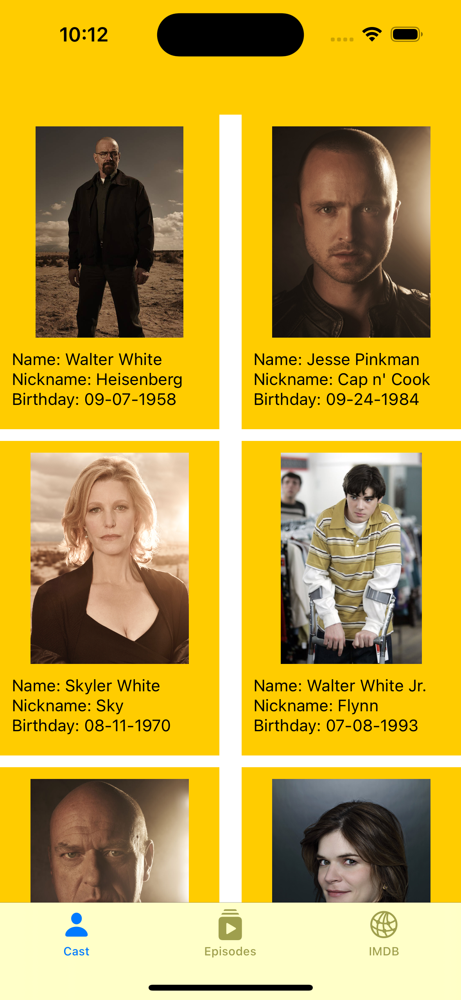
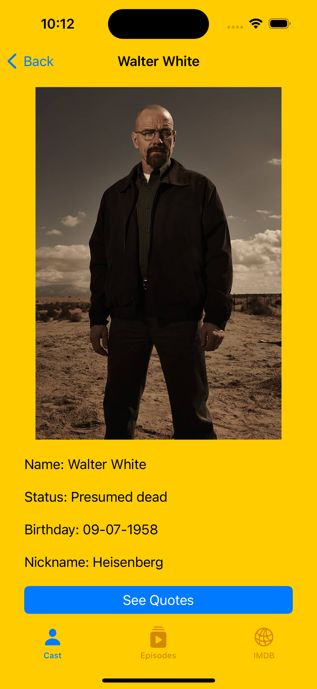
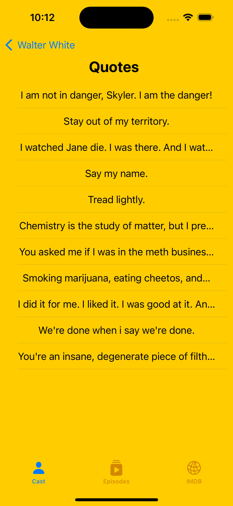
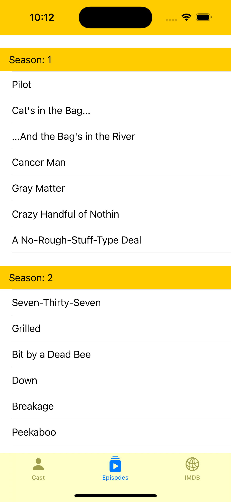
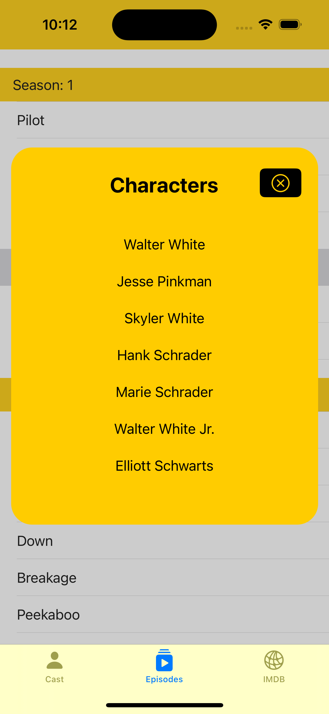
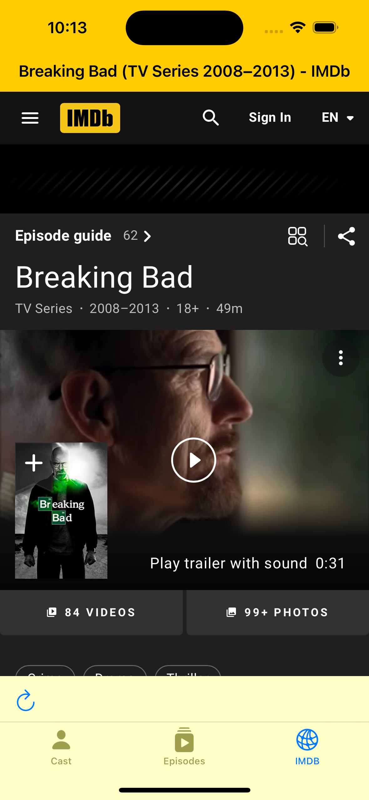

# Breaking Bad

### Description

It is an application that lists the episodes and characters of the Breakin Bad series. In this application you can also create notes about the episodes and view the IMDB page.

### Libraries Used

<li>'SDWebImage'</li>
<li>'MaterialActivityIndicator'</li>
<li>'SwiftAlertView', '~> 2.2.1'</li>

### XCODE Version
<li>XCode Version 14.1</li>

### Swift Version
<li>Swift 5 </li>

### Pattern

    MVC
    
### API
<li>https://breakingbadapi.com/</li>

### Images

  #### Character List

<table>
<tr>
<td></td>  
</td>  
</tr>
</table>

<ul>
<li>The Character List screen lists the characters with the data provided by https://breakingbadapi.com/. </li>
</ul>

#### Character Detail

<table>
<tr>
<td></td>  
</td>  
</tr>
</table>

    <li>Each character has its image and information on the detail page.</li>
    <li>The quotes of the character can be accessed with the button here..</li>
    

#### Quotes

<table>
<tr>
<td></td>  
</td>  
</tr>
</table>

    <li>The Quotes screen lists quotes for characters with data provided by https://breakingbadapi.com/ </li>
   
#### Episodes

<table>
<tr>
<td></td>  
<td></td>  
</td>  
</tr>
</table>

    <li>Episodes is a screen where the episodes of the series are listed by season.</li>
    <li>By clicking on the episodes, the list of characters taking part in the relevant chapter is shown. </li>

#### IMDB

<table>
<tr>
<td></td>  
</td>  
</tr>
</table>

    <li>The IMDB page of the series is shown on the IMDB screen.</li>

